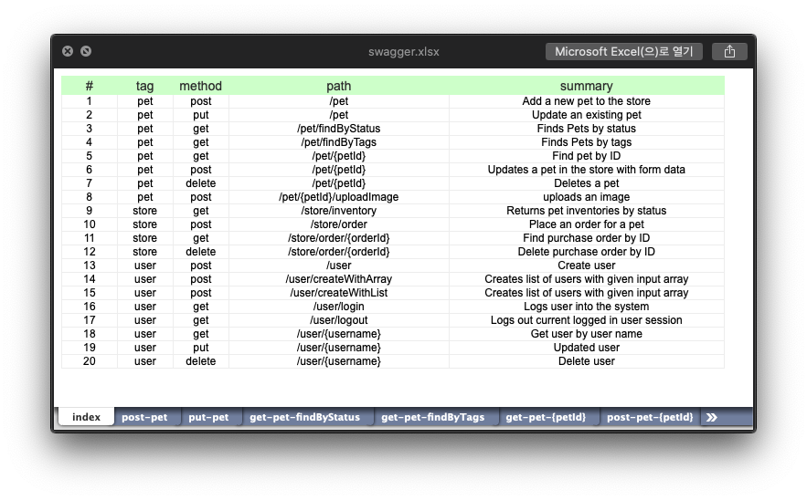
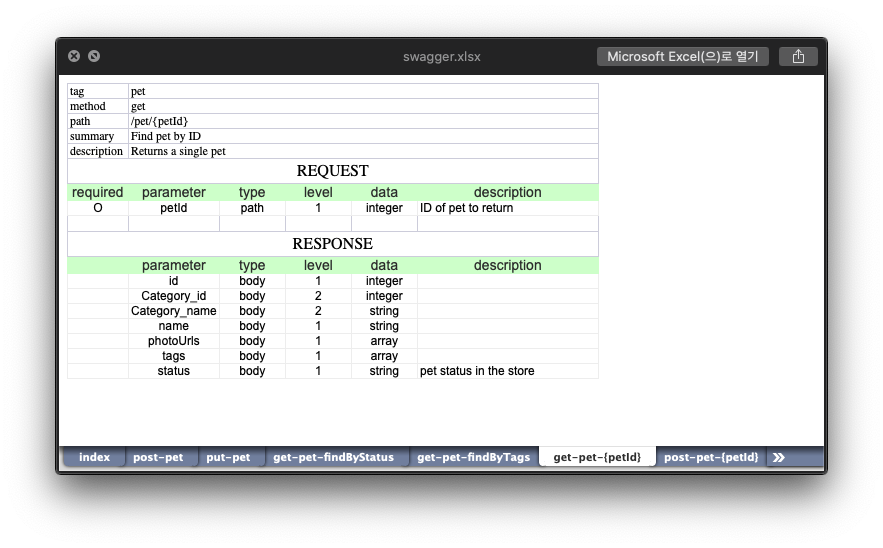

# Swagger JSON to Excel

> CLI tool for converting Swagger API specification JSON to Excel

## Getting started

### Install

```bash
npm install --global swage
```

```bash
yarn global add swage
```

### Command

```bash
swage gen --help

# generate an excel file in the current directory
swage gen <json-path>
```

## Example

- [swagger.json](https://editor.swagger.io/)

```bash
swage gen example/example.json
> output: swagger.xlsx

# or

swage gen example/example.json --output example
> output: example/swagger.xlsx
```

### Output

#### Index Sheet



#### API Specification Sheet



## Development

### Build

```bash
npm install
npm run build
```

### Run

```bash
node dist/main.js gen example/example.json --output .
```

### Local Install

```bash
npm run local
# /usr/local/bin/swage -> /usr/local/lib/node_modules/swage/dist/main.js
# + swage@0.2.1
# added 1 package from 1 contributor in 0.667s
```

### Clean

```
npm run clean
```

## Reference

- [swagger-codegen](https://github.com/swagger-api/swagger-codegen)
- [JSDoc 3](https://jsdoc.app)
- [Jest](https://jestjs.io)
- [realworld.json](https://github.com/xesina/golang-echo-realworld-example-app)
